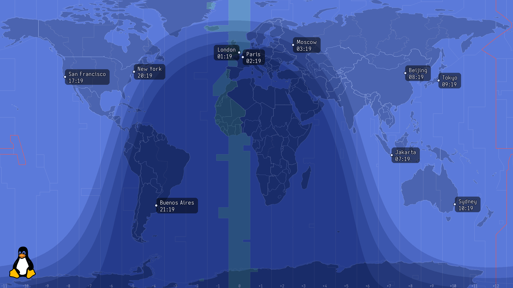
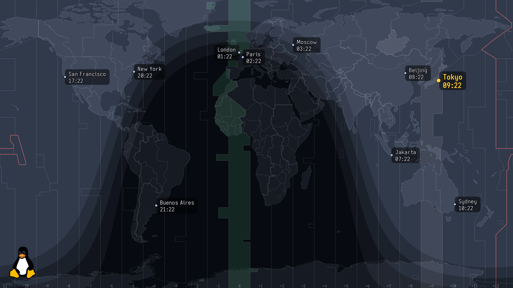
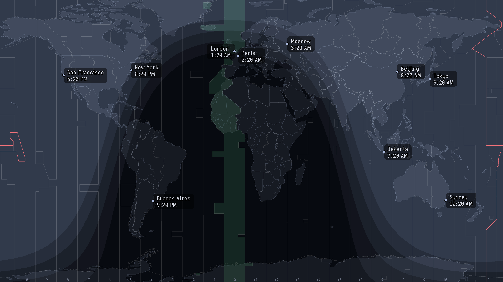
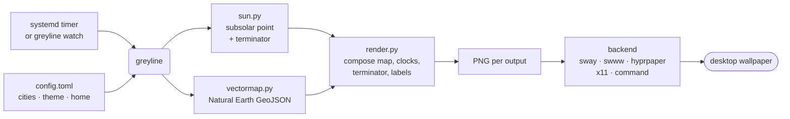

# greyline

[](https://github.com/cothinking-dev/greyline/actions/workflows/ci.yml)
[](https://pypi.org/project/greyline/)
[](https://cothinking-dev.github.io/greyline/)
[](LICENSE)

> A live world-time desktop wallpaper for Wayland/X11 — a world map with clocks for your
> cities, your home city highlighted, and a day/night terminator that tracks the sun. A modern
> recreation of the classic IBM/ThinkPad **"World Time"** Active Desktop.


<sub>Shown with the optional ThinkPad wordmark (a user-supplied logo — see [Credits](#credits)).
The bundled default logo is Tux.</sub>

**▶ [Try the live demo](https://cothinking-dev.github.io/greyline/)** — greyline running in your
browser (your timezone highlighted), no install needed.

greyline doesn't run a browser or a background daemon. A small Python program renders a PNG once
a minute and hands it to your existing wallpaper mechanism, then exits — so it's effectively free
on battery. *(greyline = the ham-radio term for the day/night terminator.)*

## Table of Contents

- [Features](#features)
- [Requirements](#requirements)
- [Installation](#installation)
- [Usage](#usage)
- [Configuration](#configuration)
- [How it works](#how-it-works)
- [Contributing](#contributing)
- [Credits](#credits)

## Features

- **Multi-timezone clocks** at each city's real location, with **accurate DST** via the OS IANA
  database (`zoneinfo`). 12h or 24h.
- **Home city** accented (dot + bold label + optional timezone-column highlight), auto-detected
  from your system timezone or pinned in config.
- **Analytic day/night terminator**, seasonally correct, with discrete civil / nautical /
  astronomical **twilight bands**.
- **Vector map** from public-domain **Natural Earth** data — crisp at any resolution, fully
  themeable (`dark`, `blue`, or custom), with honest zig-zag timezone boundaries, a green GMT
  column, and a red International Date Line.
- **Any resolution / multi-monitor / HiDPI** — each output rendered at native pixels.
- **Swappable corner logo** — ships with Tux; point `logo_path` at your own PNG.
- **Works on any desktop** — native backends for `sway`, `swww`, `hyprpaper`, `x11`
  (feh/xwallpaper), plus a generic `command` backend for **GNOME / KDE / XFCE** and anything else.
- **One-command setup** — `greyline init` detects your desktop, writes a config, and schedules
  updates.

| `blue` theme | home city accented | minimal — no logo, 12h |
|---|---|---|
|  |  |  |

## Requirements

- **OS:** Linux — **Wayland or X11**. (Not macOS or Windows; greyline drives a Linux desktop's
  wallpaper mechanism, it doesn't own the screen.) Architectures: `x86_64` and `aarch64`.
- **Python ≥ 3.11** — only when installing via pip/pipx/uv (the Nix package bundles its own).
- **Runtime dependencies:** [Pillow](https://python-pillow.org/) and
  [tomlkit](https://github.com/sdispater/tomlkit), installed automatically; plus **fontconfig**
  (`fc-match`) for font resolution.
- **A wallpaper mechanism for your desktop** — one of the tools in the table below.
- **Scheduling:** a **systemd** user timer (most distros) *or* any session autostart running
  `greyline watch` (Runit/OpenRC/s6/… — no systemd required).

greyline is **distro-agnostic** — install it with pipx/uv on any distribution, or via the Nix
flake on NixOS. Supported desktops and what each needs:

| Desktop / compositor | Backend | Needs |
|---|---|---|
| **sway** / SwayFX | `sway` | `swaymsg` |
| **Hyprland**, river, Wayfire, other wlroots | `swww` or `hyprpaper` | `swww` / `hyprpaper` daemon |
| **X11** window managers | `x11` | `feh` or `xwallpaper` |
| **GNOME** | `command` | `gsettings` |
| **KDE Plasma** | `command` | `plasma-apply-wallpaperimage` |
| **XFCE** | `command` | `xfconf-query` |
| anything else with a CLI wallpaper-setter | `command` | your own command |

`greyline init` detects your desktop and picks the backend for you; the `command`-backend rows
are **community-verified** (see [Contributing](#contributing)).

## Installation

### pipx / uv (any distro, any desktop)

```sh
pipx install greyline    # or: uv tool install greyline
greyline init            # detect your desktop, write a config, schedule updates
```

`greyline init` writes a starter `~/.config/greyline/config.toml`, auto-detects your
compositor/desktop and picks the backend (on **GNOME / KDE / XFCE** it fills in the right
wallpaper command for you), and — where systemd is present — installs and enables the
once-a-minute user timer. No `git clone`, no hand-copied units.

### Nix (flake + home-manager) — recommended on NixOS

```nix
# flake.nix
inputs.greyline.url = "github:cothinking-dev/greyline";

# home-manager
imports = [ inputs.greyline.homeManagerModules.default ];

services.greyline = {
  enable = true;
  backend = "sway";              # auto | sway | swww | hyprpaper | x11 | command
  fontFamily = "Aporetic Sans";  # resolved via fontconfig
  settings = {
    theme = "dark";
    format = "24h";
    twilight = { bands = true; darkness = "subtle"; };
    home = { tz = "auto"; column_highlight = true; };  # "auto" = system tz
    city = [
      { name = "Kuala Lumpur"; lat = 3.14;  lon = 101.69; tz = "Asia/Kuala_Lumpur"; }
      { name = "London";       lat = 51.51; lon = -0.13;  tz = "Europe/London"; }
      { name = "New York";     lat = 40.71; lon = -74.01; tz = "America/New_York"; }
      { name = "Tokyo";        lat = 35.68; lon = 139.69; tz = "Asia/Tokyo"; }
    ];
  };
};
```

### Run without installing

```sh
nix run github:cothinking-dev/greyline -- --out wt.png --res 2560x1440   # writes a PNG
uvx greyline --out wt.png --res 2560x1440                                # same, via PyPI
```

## Usage

After `greyline init`, the wallpaper updates on its own. Everything else is subcommands:

```
greyline                          # render all outputs and apply (what the timer runs)
greyline init                     # first-time setup: config + backend + scheduling
greyline watch [--interval SEC]   # render+apply on a loop (any init system / WM)
greyline config set <key> <val>   # also: get [key] / unset <key>   (edits the config file)
greyline city add "<name>" <lat> <lon> <tz> [--home]   # also: list / remove "<name>"
greyline enable | disable | status   # manage the systemd user timer
greyline doctor                   # detected backend, outputs, session, timer
greyline --list-outputs           # show detected backend + outputs
greyline --out wt.png --res WxH   # render a PNG, no backend needed
```

**Scheduling.** On systemd, `greyline init`/`greyline enable` install a user timer that runs
every minute. **No systemd?** Any init system or WM works — skip the timer and add greyline to
your session autostart:

```sh
greyline watch    # renders + applies every minute in the foreground
```

## Configuration

Edit config from the CLI (comments in the file are preserved) or edit the file directly:

```sh
greyline city add "London" 51.51 -0.13 Europe/London --home
greyline config set theme blue
greyline config set twilight.darkness dramatic
```

The shipped [`worldtime/default-config.toml`](worldtime/default-config.toml) is the documented
template. Keys:

| Key | Values |
|---|---|
| `backend` | `auto` / `sway` / `swww` / `hyprpaper` / `x11` / `command` |
| `command`, `resolution` | for the `command` backend (see below) |
| `map_style` | `vector` (default) / `raster` (bring your own art) |
| `theme`, `format` | `dark`/`blue` · `24h`/`12h` |
| `logo`, `logo_path`, `logo_invert` | corner logo (default: Tux) |
| `[twilight]` | `bands`, `darkness` (`subtle`/`medium`/`dramatic`) |
| `[home]` | `tz` (`auto` or IANA), `column_highlight`, `color` |
| `[[city]]` | `name`, `lat`, `lon`, `tz`, optional `label_side` |

### Desktop environments (GNOME / KDE / XFCE)

On desktops that manage their own wallpaper, `greyline init` configures the generic `command`
backend automatically: greyline renders a PNG and runs a command to set it as your wallpaper,
with `{path}` (the PNG) and `{output}` substituted.

> **Note:** this **replaces** your desktop wallpaper — it is not an overlay. greyline re-renders
> and re-sets it each minute; the last image stays after greyline stops.

To set the command by hand (`greyline config set command '…'`, or in the config file):

```toml
backend = "command"
# resolution = "2560x1440"   # optional; else largest xrandr output, else 1920x1080
# GNOME (empty-then-set defeats GNOME's same-URI cache; sets light + dark):
command = 'gsettings set org.gnome.desktop.background picture-uri "" && gsettings set org.gnome.desktop.background picture-uri "file://{path}" && gsettings set org.gnome.desktop.background picture-uri-dark "file://{path}"'
# KDE Plasma:
command = 'plasma-apply-wallpaperimage {path}'
# XFCE (the monitor segment varies — see: xfconf-query -c xfce4-desktop -l | grep last-image):
command = 'xfconf-query -c xfce4-desktop -p /backdrop/screen0/monitor0/workspace0/last-image -s {path}'
```

These recipes are **best-effort / community-verified** — the maintainers run sway and can't test
them directly. If yours needs a tweak, please [report it](#contributing).

## How it works

A scheduler runs `greyline` once a minute; it renders a PNG per output and hands each to the
detected backend, then exits.



- **`sun.py`** — subsolar point + terminator/twilight boundary latitudes (pure astronomy math).
- **`geo.py` / `vectormap.py`** — lon/lat → pixel projection; the vector map is drawn from
  Natural Earth GeoJSON (supersampled for smooth coastlines).
- **`render.py`** — composites map + overlays, then draws clocks at native resolution with smart
  label placement (labels pick a side to avoid overlapping each other and the edges).
- **`backends/`** — the only platform-specific code; everything else is portable.

## Contributing

greyline is a **personal passion project**, built and maintained in spare time and released as
**free and open-source software** (GPL-2.0-or-later). It's a labour of love, not a product —
issues, desktop-compatibility recipes, and pull requests are all welcome.

- Found a bug, or a `command` recipe that needs tweaking on your desktop?
  [Open an issue](https://github.com/cothinking-dev/greyline/issues/new/choose) — there's a
  dedicated **desktop-compatibility report** template for GNOME/KDE/XFCE.
- Run the tests with `nix flake check`, or `pytest` in the dev shell.

## Credits

Code is **GPL-2.0-or-later**. It descends from Maxim Proskurnya's GPL "World Time Wallpaper"
tribute; the concept and original artwork are © IBM/Lenovo.

The default **vector** map uses public-domain **Natural Earth** data, and the default logo is
**Tux** (Larry Ewing / GIMP) — both cleanly redistributable. The original IBM/Lenovo ThinkPad
raster art and wordmark are **not** bundled; `map_style = "raster"` and the ThinkPad logo require
you to supply those files yourself (see [`NOTICE`](NOTICE) and [`docs/CREDITS.md`](docs/CREDITS.md)).

> Built with the assistance of AI coding tools.
